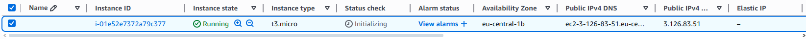
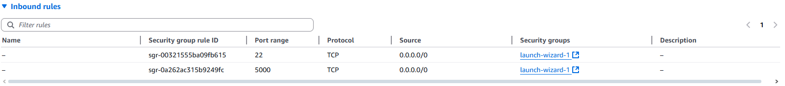
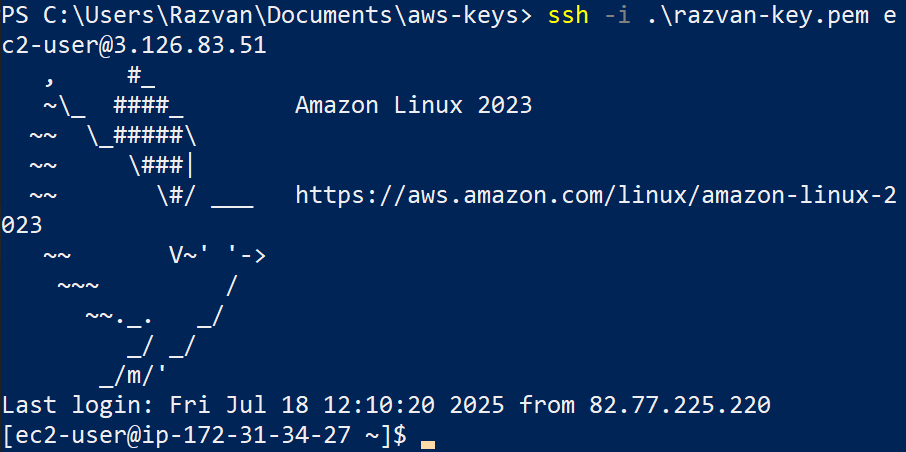
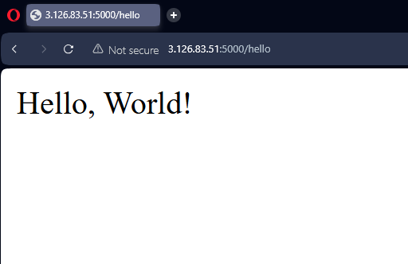

# Cloud-Hosted Python Web App with AWS, Terraform & CI/CD

This project demonstrates how to deploy a simple Python Flask web application to AWS EC2, first manually and later fully automated using Terraform and GitHub Actions (CI/CD).

✅ Skills showcased:
- AWS EC2, VPC, security groups
- SSH & Linux server management
- Python Flask development
- Infrastructure as Code (Terraform)
- CI/CD pipelines with GitHub Actions

---

## 🚀 Live App (Manual Deployment)

The app is currently running on an AWS EC2 instance (manual deployment).  
Visit: `http://3.126.83.51:5000/hello`

---

## 📂 Project Structure

app.py # Flask application
.idea/ # (excluded via .gitignore)
.gitignore # Ignore IDE & Python artifacts
README.md # This file

---

## 💻 How It Works

The web app has two endpoints:
- `/hello` → returns “Hello, world”
- `/health` → returns “OK”

---

## 📝 Screenshots

Below are screenshots of the project at various stages:

### ✅ EC2 Instance Dashboard
Shows the EC2 instance running in AWS console.

### ✅ Security Group Rules
Shows inbound rules allowing SSH (22) and Flask app (5000).

### ✅ SSH into EC2
Connected to the EC2 server from local machine.

### ✅ Web App in Browser
Output of `/hello` endpoint.

---

## 🧰 Next Steps

✅ Automate infrastructure with Terraform  
✅ Automate deployment pipeline with GitHub Actions

---

## 👤 Author

- Razvan
- [GitHub Profile](https://github.com/your-github-username)